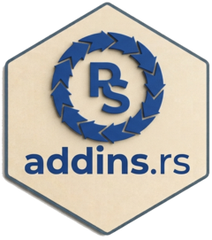

<!-- README.md is generated from README.Rmd. Please edit that file -->

```{r, echo = FALSE}
knitr::opts_chunk$set(
  collapse = TRUE,
  comment = "#>",
  fig.path = "README-"
)
```

<!-- badges: start -->
<!-- [](https://cran.r-project.org/package=addins.rs) -->
[`-brightgreen.svg)](https://github.com/GegznaV/addins.rs)
[](https://github.com/GegznaV/addins.rs/actions)
[)`-yellowgreen.svg)](/commits/master)
[](https://opensource.org/licenses/MIT)
<!-- badges: end -->


***

R package **addins.rs** <a href="https://gegznav.github.io/addins.rs/"></a>
=========================================================================

Package `addins.rs` is an R package that provides a set of RStudio add-ins which
are designed to be used in
combination with user-defined RStudio keyboard shortcuts. These
add-ins:

1. Insert various R operators, including `%>%`, `<<-`, `%$%`;  
2. Replace certain symbols (e.g., strings like `"c:\data\"` converted into `"c:/data/"`. This can be useful for Windows users);  
3. Align code at certain symbols.


Install package
---------------------------

<!-- Install released version from CRAN: -->
<!-- ```{r Install package from CRAN, eval=FALSE} -->
<!-- install.packages("addins.rs") -->
<!-- ``` -->

Install development version from GitHub:
```{r Install package from GitHub, eval=FALSE}
if (!require(remotes)) install.packages("remotes")

remotes::install_github("GegznaV/addin.tools")
remotes::install_github("GegznaV/addins.rs")
```

***

More information at http://gegznav.github.io/addins.rs/

